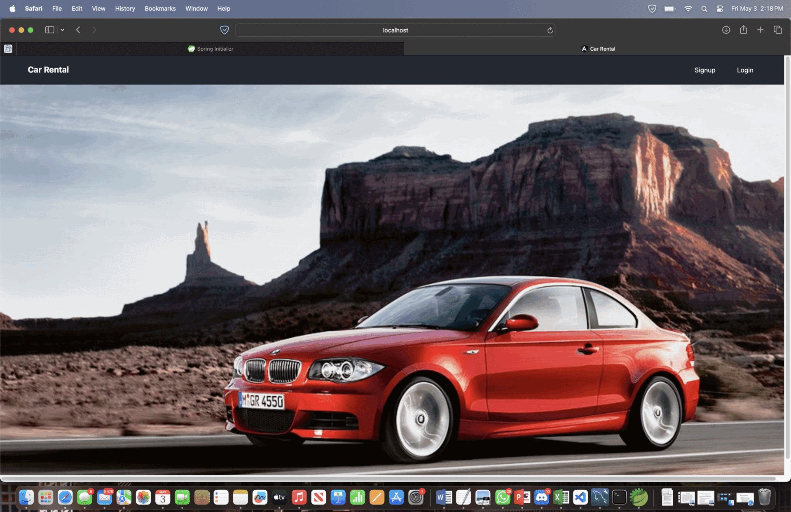

# Angular Frontend and Spring Boot Backend

This repository contains code for a Car-Rentals application built with Angular on the frontend and Spring Boot on the backend and MySql.

- <h3> <a href="https://docs.google.com/document/d/1L4aRVy6VxyHYHMweGLFgMNeTSl0YdgLaBCh0LmzX1Qg/edit?usp=sharing">Project Report CS-157A</a></h3>

## Prerequisites

Before you begin, ensure you have met the following requirements:

- Node.js and npm installed on your machine. You can download and install them from [Node.js website](https://nodejs.org/).
- Angular CLI installed globally. You can install it via npm by running:
- Java Development Kit (JDK) installed on your machine. You can download and install it from [Oracle's website](https://www.oracle.com/java/technologies/javase-jdk11-downloads.html).
- Apache Maven installed on your machine. You can download and install it from [Maven's website](https://maven.apache.org/download.cgi).

## Running the Backend (Spring Boot)

1. Clone this repository to your local machine.
2. Navigate to the `backend` directory:
3. Build the project using Maven:
4. Run the Java application:
This will start the backend server on `http://localhost:8080`.

## Running the Frontend (Angular)

1. Navigate to the `frontend` directory:
2. Install dependencies by running $npm install
3. Start the Angular development server by running $npm run start
This will compile the Angular application and start a development server on `http://localhost:4200`.

## Running the MySQL (Angular)

1. Run the Mysql server and create a local instance and connect it.
2. Create a database name rentacar_db.
3. Make sure to change your mysql username and password in application.properties file

## Accessing the Application

Once both the backend and frontend servers are running, you can access the application by opening a web browser and navigating to `http://localhost:4200`.

## Additional Notes

- The backend Spring Boot application is configured to run on port `8080` by default. If you need to change this port, you can modify the `application.properties` file located in the `backend/src/main/resources` directory.
- Similarly, the frontend Angular application is configured to proxy requests to `http://localhost:8080`, assuming the backend is running on the default port. If your backend is running on a different port, you may need to update the `proxy.conf.json` file in the `frontend` directory accordingly.
